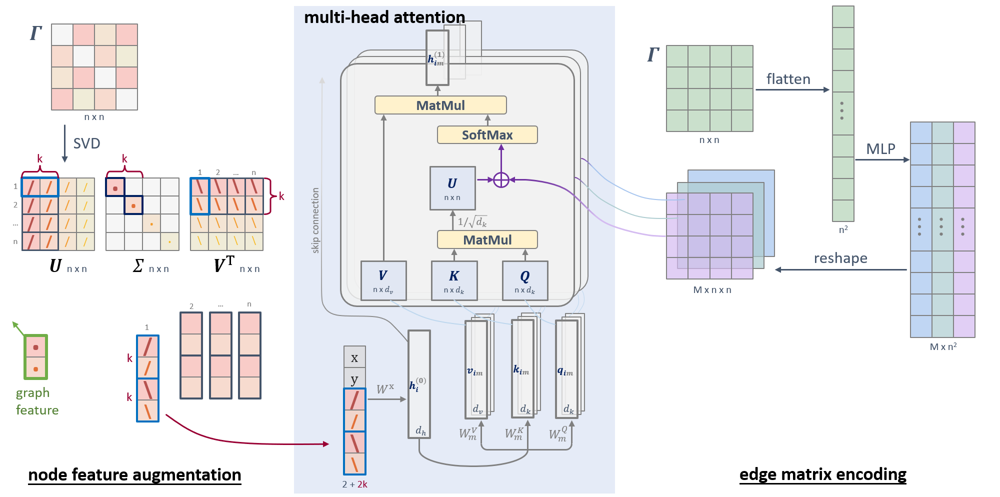

# Benchmarking 


# OLD version
# Extending Attention-based Vehicle Routing Problem (VRP) Solvers to Non-Euclidean instances
**UC Berkeley CS 182/282A course project | 2023 Fall**\
Yi Ju, Xinxian Chen, Joshua Walter Jones, Kai Ma, Yifan Yin




our work is built on the basis of [Attention, Learn to Solve Routing Problems!](https://github.com/wouterkool/attention-learn-to-route)

## instruction for reproduce our paper
### our implementations
- the main code is under `AM2019/`, particularly, we modified `run.py`, `train.py`, `nets/attention_model.py`, `nets/graph_encoder.py`, `problems/tsp/problem_tsp.py`, etc. For more details, you can refer to:
  - [#15](https://github.com/YiJU-thu/VRP-cs182/pull/15), [#24](https://github.com/YiJU-thu/VRP-cs182/pull/24): implement node feature augmentation part
  - [#31](https://github.com/YiJU-thu/VRP-cs182/pull/31): implement edge encoding part.
- we also implement some util functions. particularly, methods in `utils_project/uils_vrp.py`: `normalize_graph`, `recover_graph`, `get_random_graph` methods

### training
- dependencies: when you are at `AM2019/`, you can run
```
conda env create --file environment.yml
```
to create a conda environment called `tsp`. You can also look at that file to see what packages we use. You can run a simple test run:
```
# suppose you are at /AM2019
python run.py --graph_size 20 --non_Euc --run_name 'nE_tsp20_test' --wandb_entity <your wandb username> (or --no_wandb)
```
- for model options, please refer to `AM2019/options.py`

### evaluation
- under `AM2019/pretrained/Nov28-cs182`, we provide our trained model. (we remove the optimizer states to save space, so you cannot resume training from this checkpoint, but only use for inference)\
for evaluation, please use methods provided in `AM2019/am_nE_tsp_eval.py`
- under `dataset`, we provide a small subset (100 instances for each) of the Amazon VRP dataset and random datasets. The entire datasets are too large to be included in this repository. You can use:
 - `dataset/make_rnd_dataset.py` to generate random datasets
 - refer to [this repo](https://github.com/YiJU-thu/eCal_datasets/tree/main/Amazon_VRP) to make Amazon VRP dataset.
- all evaluation results (cost, tour, time) can be find in `AM2019/eval_res`, and summarized in `eval_res/am_eval_log.xlsx`

### Concorde benchmark
- you need to install Concorde TSP solver. We use [pyconcorde](https://github.com/jvkersch/pyconcorde).
- use script `PyConcorde/concorde_solve.py` to solve TSP instances. Concorde is designed to solve symmetric TSP, so we need extra tricks to convert ATSP as a symmetric TSP.
- optimal solutions ssolved by concorde can also be found under `PyConcorde`, e.g., `CCD_amazon_eval.pkl`

### training logs
- please see `analysis/wandb_training`

:warning: **Attention** :warning:
currently, commands at the original AM repo's README may not be compatible with our code. You are welcome to report an issue when you find one.


**We wish you understand that our work, as a research project, is still undergoing.**
We request you use this code repository only for peer review purpose. You are welcome to run some experiments yourself, but please do not folk the repository.

**We look forward to your suggestions & comments.**


***
**The following are for our team members**


:warning: **Attention** :warning:
- if you do not want something to be tracked by git, name the file / folder with **NoTrack** or **TEST** in the name.
    - e.g., do NOT add your wandb API key somewhere in the code
- git collabration on Jupyter notebook can be annoying. We suggest use Jupyter notebooks ONLY for personal debugging purpose.

## wandb
We use [wandb](https://wandb.ai/) for experiment tracking. Please create an account and get your API key. Then run the following command to eport your API key to the environment variable.
```
export WANDB_API_KEY=<your_api_key_here>
```
Please let Yi know your username / email so that he can add you to the `ecal_ml4opt` team.\
When train the model, wandb related args are:
```
--no_wandb # if you do not want to use wandb
--run_name <run_name> # this will also be the run_name on wandb
--who <your_initials> # this will be added to the run name, so that it's easier to filter your own experiments
``` 

Now, try to have a test run:
```
# suppose you are at /AM2019
python run.py --graph_size 20 --run_name 'tsp20_test' --wandb_entity ecal_ml4opt --who <your_initials>
```


## dataset
The entire Amazon VRP dataset (3.3 GB -> 1.6 GB only keep used info) is too large to be included in this repository. We only provide a small subset under the folder `/dataset` for debugging purpose, and keep the full dataset on the server where we have access to. We also provide script to download the full dataset on your server / local machine.
```
coming soon ...
```